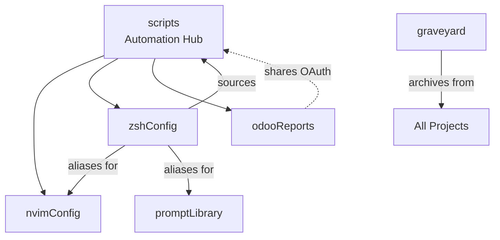

# Documentation Dashboard

**Last Updated**: 2025-11-14 12:24:45

## Overview

This dashboard provides a real-time view of documentation health across all projects.

## Quick Links

| Project | Documentation | GitHub | Last Updated |
|---------|--------------|--------|--------------|
| ❌ agents | Missing | - | - |
| ❌ archive | Missing | - | - |
| ❌ gitCheatsheet | Missing | - | - |
| 🟢 graveyard | [CLAUDE.md](../../projects/graveyard/CLAUDE.md) | - | 2025-11-07 10:16 |
| 🟡 homeLab | [CLAUDE.md](../../projects/homeLab/CLAUDE.md) | [homeLab](https://github.com/jaded423/homeLab) | 2025-11-07 15:51 |
| ❌ image-converter | Missing | - | - |
| ❌ kinesis | Missing | - | - |
| 🟡 lostLead | [CLAUDE.md](../../projects/lostLead/CLAUDE.md) | [lostLead](https://github.com/jaded423/lostLead) | 2025-11-11 10:51 |
| 🟢 n8nDev | [CLAUDE.md](../../projects/n8nDev/CLAUDE.md) | [n8nDev](https://github.com/jaded423/n8nDev) | 2025-11-07 10:17 |
| 🟢 n8nProd | [CLAUDE.md](../../projects/n8nProd/CLAUDE.md) | [n8nProd](https://github.com/jaded423/n8nProd) | 2025-11-07 10:17 |
| 🟢 nvimConfig | [CLAUDE.md](../../projects/nvimConfig/CLAUDE.md) | [nvimConfig](https://github.com/jaded423/nvimConfig) | 2025-11-07 10:07 |
| 🟢 odooReports | [CLAUDE.md](../../projects/odooReports/CLAUDE.md) | [odooReports](https://github.com/jaded423/odooReports) | 2025-11-07 10:13 |
| ❌ pong | Missing | - | - |
| ❌ pong2 | Missing | - | - |
| 🟢 promptLibrary | [CLAUDE.md](../../projects/promptLibrary/CLAUDE.md) | [promptLibrary](https://github.com/jaded423/promptLibrary) | 2025-11-07 10:05 |
| 🟢 scripts | [CLAUDE.md](../../projects/scripts/CLAUDE.md) | [scripts](https://github.com/jaded423/scripts) | 2025-11-14 11:38 |
| ❌ signatures | Missing | - | - |
| 🟢 zshConfig | [CLAUDE.md](../../projects/zshConfig/CLAUDE.md) | [zshConfig](https://github.com/jaded423/zshConfig) | 2025-11-07 10:15 |

## Documentation Metrics

### Summary Statistics

| Metric | Value |
|--------|-------|
| **Total Projects** | 18 |
| **Documented Projects** | 10 |
| **Missing Documentation** | 8 |
| **Total Documentation Lines** | 1,494 |
| **Average Lines per Project** | 149 |

### Documentation Health

Health scores are calculated based on:
- 📏 **Size** (25%): Optimal between 100-200 lines
- ⏱️ **Freshness** (25%): Recently updated
- 📁 **Structure** (25%): Has docs/ directory and changelog
- ✅ **Completeness** (25%): Has content and symlinks

| Legend | Score | Meaning |
|--------|-------|---------|
| 🟢 | 80-100 | Excellent |
| 🟡 | 60-79 | Good |
| 🟠 | 40-59 | Needs Attention |
| 🔴 | 0-39 | Critical |

### Projects Needing Attention

✨ All projects have healthy documentation!

## Cross-Project Dependencies

### Shared Resources

| Resource | Used By | Purpose |
|----------|---------|---------|
| Gmail OAuth (~/scripts) | odooReports, scripts | Email automation |
| gitBackup.sh | All projects | Hourly automated backups |
| SSH Keys | All git projects | GitHub authentication |
| .zshrc aliases | All projects | Quick navigation and commands |

### Dependency Graph



## Recent Documentation Updates

| Project | Last 7 Days | Last 30 Days | Older |
|---------|------------|--------------|-------|
| Count | 10 | 0 | 0 |

## Automation Status

### Active Systems

| System | Status | Schedule | Last Run |
|--------|--------|----------|----------|
| Git Backup | ✅ Active | Hourly | Check logs: `log show --predicate 'eventMessage contains "git_backup"' --last 1h` |

## Quick Actions

### Update Documentation
```bash
# Update this dashboard
~/.claude/bin/update-dashboard.sh

# Document current session
/log

# Archive old changelogs
/sum

# Check documentation metrics
doc-check  # In terminal
```

### Fix Common Issues
```bash
# Fix missing symlinks
cd ~/projects/PROJECT_NAME
ln -sf CLAUDE.md GEMINI.md
ln -sf CLAUDE.md AGENTS.md

# Initialize documentation for new project
cd ~/projects/NEW_PROJECT
/init
```

---

*Dashboard generated automatically. Run `~/.claude/bin/update-dashboard.sh` to refresh.*
